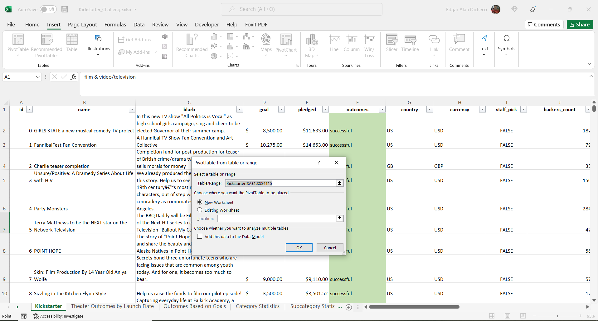
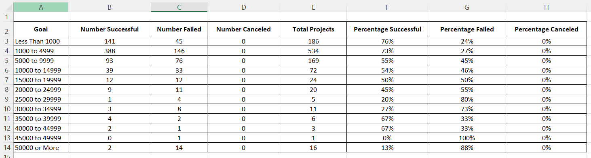

# Kickstarting with Excel

## Overview of Project

### Purpose
Louis had the experience of raising funds to carry out the play "Fever" in which was close to reaching the funding goal in a short period of time. Based on the data set provided, Louis wants to research the past results of the funding campaigns of other plays, she wants to know how many were successful, failed and canceled, all in relation to two factors: launch date and funding goal. It should be noted that this data set includes cases registered between 2009 and 2017.

## Analysis and Challenges

### Analysis of Outcomes Based on Launch Date
A. From the data set on the Kickstarter sheet, I built a Pivot Table
 
   
 

B. Create the pivot table to display the results of the campaigns: successful, failed and canceled in relation to the launch dates
   
   In the filter area, I used Parent category and the column "Years" (this was generated using the formula years). In the row area, I selected the months of the column Data Created Conversion (taking out the years, quarters, and days). And finally in the value area I included the count of the column Outcomes.

   

C. I applied in the Parent category filter the value "Theater".
   Finally resulting in the following table:
   
   

   This is on the sheet Theater Outcomes by Launch Date [Theater Outcomes](Kickstarter_Challenge.zip).

D. Created the following chart of the pivot by clicking the option Pivot Chart
   Resulting in the following table: 

   

### Analysis of Outcomes Based on Goals
A. I Created the sheet "Outcomes Based on Goals" to visualize the percentage of successful, failed, and canceled plays based on the funding goal amount.
   

B. The columns created were Goal, Number Successful, Number failed, Number canceled, Total projects, Percentage Successful, Percentage failed and Percentage canceled.
   
   The Goals column was captured as indicated in the activity, using the same giving ranges.

   The data of the Number Successful, Number failed, Number canceled columns was obtained based on the COUNTIFS formula and with the Kickstarter data set.

   The columna total pojects is a sum of the results in the columns Number Successful, Number failed, Number canceled.

   The percentages columns (F,G and H) use a formula that takes the number of successful, failed and canceled projects (each respectively) divided by the total projects * 100.

   Resulting in the following:

   

C. I generated a graph of the Goal ranges and each of the result percentages:

 

   

### Challenges and Difficulties Encountered
- YEAR() function to extract the year from the Data Created Conversion
  I have some problems with this formula, however I did a little bit of research and found how it works:
  
  Year Function documentation [YEAR Function](https://support.office.com/en-us/article/year-function-c64f017a-1354-490d-981f-578e8ec8d3b9)
  With this information I applied the formula YEARS in the Kickstarter tab, by doing this I obtained the year for each project instead of having the full date.

- COUNTIFS()
  I used this formula to get the each of the specific results: successful, failed and canceled. Again I use the internet to understand how the formula works
  COUNTIFS Function documentation [COUNTIFS Function](https://support.office.com/en-us/article/countifs-function-dda3dc6e-f74e-4aee-88bc-aa8c2a866842)
  I used this info and applied the formula in the sheet "Outcomes Based on Goals" and I got the count for each of the columns
   
   

## Results

**- What are two conclusions you can draw about the Outcomes based on Launch Date?**
  By reviewing the results of the sheet "Theater Outcomes by Launch Date", we can conclude the following:
   - In the month of May, the highest number of successful campaigns was obtained with a total of 111 projects. It is worth mentioning that considering a total of 166 campaigns, it gives us an effectiveness percentage of 67%, being the highest of all months.
   - In the month of December, the least number of successful results was recorded with 37 out of a total of 75, which gives us an effectiveness percentage of 49%, being the lowest of all months.

**- What can you conclude about the Outcomes based on Goals?**
  By reviewing the results of the sheet “Outcomes based on Goals”, we can conclude the following:
  
  With a goal of less than 1,000 dollars, there was a total of 186 projects, of which 141 were successful. This gave us an effectiveness percentage of 76% being the highest among the rest of the ranges.
  The goal range less than 1000 has the best chance of success for a theater campaign. It is important that the person who makes the decision establishes the level of risk with respect to the probability of success of the play, since there are other percentages that are above 50%, which have an advantage over the other options.

**- What are some limitations of this dataset?**
  One possible table that could help understand better the results could be a table with the Percentage of effectiveness of successful campaigns by month of launch. I decided to be included this because the raw number of total successful does not tell the whole story, that’s why we should look at a percentage rate and evaluate the months with this measure. Also, I would include a visualization of this same table with a graph showing the results by month, by doing this we can have a clear look at the results.

**- What are some other possible tables and/or graphs that we could create?**

  **Percentage of effectiveness of successful campaigns by month of launch**
   

  **Graph Percentage of effectiveness for each month**
    
